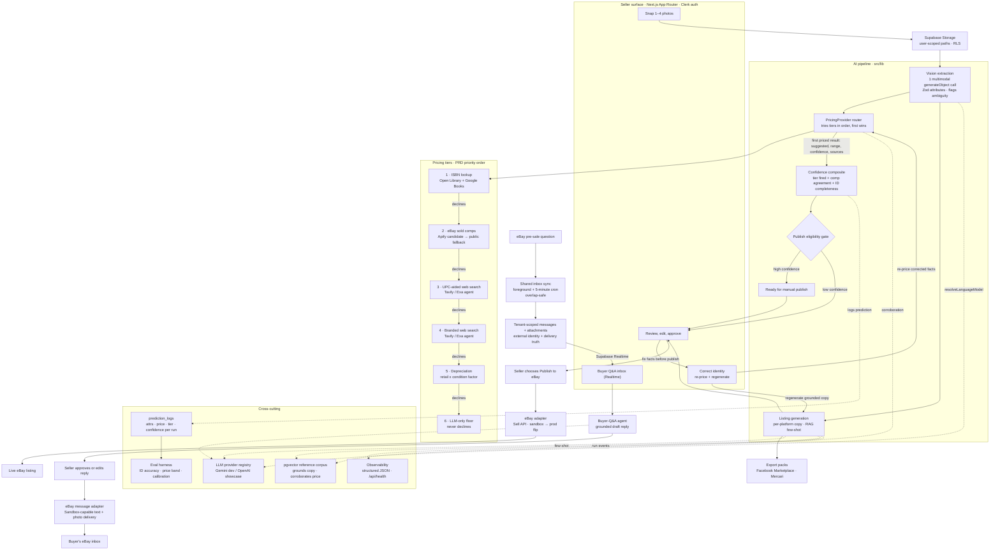

# SnapList

Snap a photo of a resale item → get a priced, ready-to-post marketplace listing. SnapList prefers
real sold comps when available, then falls back to cited web or depreciation evidence or a clearly
labeled, potentially uncited LLM-only estimate, always with a confidence score. Built for resellers;
a production-real AI-engineering showcase.

> **Docs:** [`PRD.md`](./PRD.md) is the source of truth for what we build · [`CONTEXT.md`](./CONTEXT.md)
> is the domain glossary · [`AGENTS.md`](./AGENTS.md) is the agent/engineering guide ·
> [`PROJECT_BRIEF.md`](./PROJECT_BRIEF.md) is origin context (superseded by the PRD). See
> [`docs/`](./docs) for ADRs, architecture, marketplace setup, security, and strategy notes.

## What it is
Resellers list in volume, and the per-item work doesn't scale: for every flip — thrift finds,
sneakers, streetwear, electronics, games, LEGO — you photograph it, research what it actually
*sold* for used (not retail, not the optimistic asking price), write a platform-appropriate listing,
post it, then answer the same buyer questions over and over. Real *sold* prices are the hard part,
and retail prices mislead for used goods. Multiply that by a haul and the research alone eats the day.

SnapList collapses that into a photo plus a couple of approvals so a reseller can clear a whole haul
in one pass. The seller snaps 1–4 photos; the system identifies the item (brand, model, category,
condition, specs, any barcode/ISBN), researches a defensible price range from real sold comps when
available, cited web or depreciation evidence when those tiers resolve, or a clearly labeled
terminal LLM-only estimate that may be uncited, writes per-platform listing copy, and shows it for
review. Before publishing, the seller can correct the load-bearing identity facts and explicitly
re-price and regenerate a coherent draft without losing a saved price override. That override becomes
the effective outbound price for eBay and both export packs; the AI suggestion remains separate as
recommendation and eval history. High-confidence
items are marked ready to publish by the confidence gate; lower-confidence items are sent to
review. Nothing posts automatically: the seller explicitly chooses **Publish to eBay**,
which goes through the adapter. SnapList also provides copy-paste export packs for
Facebook Marketplace and Mercari, and a buyer-Q&A agent drafts grounded replies the seller approves.
The seller can add supported photos; approved text and photos are delivered as one eBay message.
Clearing a whole haul? **Bulk capture** takes item after item in one session through the same
pipeline and lands on a live triage list of the batch. SnapList is the seller's **control surface** —
payment, checkout, and shipping stay on eBay; buyers never see it.

This repo is built as a **production-real AI-engineering showcase**: the AI pipeline *is* the product,
and the goal is the full stack working end-to-end in a deployed app. The
[skills-on-display map](#skills-on-display) shows where each technique lives.

## Architecture
One spine, seen three ways: **which pricing tier fired → the confidence composite → eval
calibration.** A photo becomes Zod-validated attributes; the pricing router walks its tiers in
priority order and returns the first that handles the item; a signal-based confidence score (never an
LLM self-report) gates publish eligibility; and every run is logged for the eval harness.



**Reading the diagram.** Photos land in user-scoped Supabase Storage (RLS). A single multimodal
`generateObject` call extracts attributes and *flags* anything ambiguous instead of guessing. The
`PricingProvider` router tries six tiers in priority order and returns the first that handles the
item, always shaped as `{ suggested, range, confidence, sources[] }`. The confidence composite —
tier fired + comp agreement + identification completeness — drives publish eligibility: high
confidence is marked ready and everything else stays in review. Nothing posts in the background;
the seller chooses **Publish to eBay**, which invokes the adapter (sandbox today; a credential flip
to production). Listings also render copy-paste export packs for Facebook Marketplace and Mercari.
A shared overlap-safe service imports active-listing
questions on foreground refresh and a five-minute cron, persists exact provider identities under
RLS, imports supported buyer-photo metadata, renders it through an authenticated proxy, and lets
Realtime update the inbox. A grounded agent drafts one reply for seller approval; acknowledged
text-and-photo replies and follow-ups go back through the eBay messaging adapter as one delivery
attempt, while failed or ambiguous attempts stay visibly retryable. Cutting across all of it: a
role-keyed LLM provider registry (Gemini in dev, OpenAI for the showcase), a pgvector reference
corpus that grounds copy and corroborates price, per-run prediction logs feeding the eval harness,
structured-JSON observability, and Clerk auth with Postgres RLS enforcing per-user isolation everywhere.

The pre-publish correction loop replaces bounded identity facts (brand, model, category, condition,
valid ISBN/UPC, and relevant specifications), then reruns pricing, confidence, and listing generation.
Its RLS-scoped transaction atomically advances the item, eBay draft, and prediction log, preserves a
saved seller price override, invalidates stale export packs, rejects stale/live review state, and never
publishes automatically.

Every outbound consumer resolves price through one contract: a valid seller override first, otherwise
the latest pipeline suggestion. eBay claims that price with the coherent review snapshot before its
adapter call. Facebook Marketplace and Mercari can reuse cached generated copy, but they attach the
current effective price and reject an in-flight load if a concurrent seller-price edit advanced the
review revision.

> This diagram tracks the current build and will keep maturing with the project — real pre-sale text
> messaging is Sandbox-capable while production activation stays owner-controlled under #17
> ([operator runbook](./docs/ebay-messaging-sandbox.md),
> [#17](https://github.com/azizu06/snaplist/issues/17), [#65](https://github.com/azizu06/snaplist/issues/65)).

## Stack
Next.js (App Router) + TypeScript · Vercel AI SDK + OpenAI · Tavily/Exa web search · Clerk · Supabase
(Postgres + pgvector + Realtime + Storage) · Zod · Tailwind + shadcn/ui · Vercel · eBay
Sell Inventory + Trading + Commerce Message APIs (sandbox → production, behind adapters) · Docker +
GitHub Actions.

## Getting started
```bash
pnpm install
cp .env.example .env.local   # fill in keys
pnpm supabase start          # local Supabase stack (needs Docker)
pnpm dev                     # http://localhost:3000
```

## Scripts
| Command | What |
|---|---|
| `pnpm dev` | Run the app (Turbopack) |
| `pnpm build` | Production build (works with **no secrets** — env validation is lazy) |
| `pnpm test` | Run unit/contract tests (Vitest) |
| `pnpm test:watch` | Vitest watch mode |
| `pnpm typecheck` | `tsc --noEmit` |
| `pnpm lint` | ESLint |
| `pnpm smoke:sold-comps` | Sold-comps egress/router smoke (0 requests by default; doubly confirmed live mode in the [operator procedure](./docs/sold-comps-egress.md)) |
| `pnpm benchmark:apify-readiness` | Zero-network balanced-condition adapter/matcher contract and aggregate readiness evidence |
| `pnpm eval` | Eval harness — offline by default (see below) |
| `pnpm supabase` | Supabase CLI |

## How we build
Tracer-bullet development with TDD — thin end-to-end threads, tested at the highest seam, proven
before the next. See [`AGENTS.md`](./AGENTS.md) and [`docs/agents/`](./docs/agents).

## Skills on display
The pipeline spine — *which pricing tier fired → confidence composite → eval calibration* — is one
idea seen three ways. The map from skill to code:

| Skill | Where |
|---|---|
| Multimodal vision extraction | `src/lib/vision` — one `generateObject` call over the photos → Zod-validated attributes + flagged identification |
| Agents + tool calling | `src/lib/pricing/providers` (web-search pricing agent over Tavily/Exa) · `src/lib/inbox` (grounded buyer-Q&A reply agent) |
| RAG + pgvector | `src/lib/rag` — seeded reference corpus, HNSW + cosine via the `match_reference_corpus` RPC; one retrieval feeds pricing corroboration **and** few-shot listing copy |
| Pricing as a routing pipeline | `src/lib/pricing/router.ts` — ISBN lookup → eBay sold comps → UPC-aided web → branded web → depreciation → LLM fallback, every result `{ suggested, range, confidence, sources[] }` |
| Signal-based confidence (never LLM self-report) | `src/lib/confidence` — pure composite of tier fired + comp agreement + ID completeness; gates manual-publish eligibility |
| Structured outputs | Zod everywhere a model speaks: `src/lib/pipeline/types.ts`, `src/lib/listing/schema.ts` — no ad-hoc JSON parsing |
| Prompt/context engineering | `src/lib/listing` + `src/lib/export` — per-platform copy generation, used-vs-new disambiguation |
| Coherent human correction loop | `src/lib/pipeline/review-regeneration.ts` + the review RPCs — bounded identity edits, shared pricing/confidence/listing seams, revision guards, atomic RLS persistence, stale export invalidation |
| Seller-controlled outbound price | `effectivePrice` + eBay publish/export persistence seams — override-first fallback, cent-safe validation, cached-pack freshness, and revision guards |
| Evals + calibration | `src/lib/eval` — gold set, ID/pricing metrics, reliability buckets + ECE, LLM judge validated against human labels |
| Security | Clerk auth (Supabase third-party JWTs) + RLS on every domain table (tested in `src/lib/supabase/rls.test.ts` against minted tokens), user-scoped storage paths, generation-bound eBay dispatch, lazy env validation (`src/lib/env.ts`), signed account-deletion erasure |
| Marketplace integration behind an adapter | `src/lib/marketplace` (eBay Sell + Trading/Message/Media APIs, sandbox) · export packs for FB Marketplace/Mercari |
| Docker / CI / observability | `Dockerfile`, `.github/workflows/ci.yml`, `src/lib/observability.ts`, `/api/health` |

## Eval harness
`pnpm eval` is **offline by default**: it scores the checked-in sample predictions against the
~36-item gold set (`src/lib/eval/fixtures/`) with a deterministic heuristic judge — no network, no
keys, no database. The report covers identification accuracy, price-band accuracy, confidence
calibration (reliability buckets + ECE), and judged listing quality; every run also validates the
active judge against a small human-labeled subset. Flags opt into the real world:

```bash
pnpm eval                       # offline: fixtures + heuristic judge (what CI runs)
pnpm eval --db                  # score real logged runs from Supabase (service-role key required)
pnpm eval --real-judge          # LLM judge instead of the heuristic (OPENAI_API_KEY)
pnpm eval --predictions f.json  # score an arbitrary predictions file
```

## Eval results
Headline numbers from the gold set, populated once the eval-metrics work
([#61](https://github.com/azizu06/snaplist/issues/61)) lands. Until then, run `pnpm eval` for the
live offline report.

| Metric | Value |
|---|---|
| Identification accuracy (field-level) | _TODO (#61)_ |
| Pricing within band (% of items) | _TODO (#61)_ |
| Median price error | _TODO (#61)_ |
| Confidence calibration (ECE) | _TODO (#61)_ |

> These measure pipeline consistency against authored gold labels, **not** field accuracy against
> real sold prices — see [Honest accuracy ceiling](#honest-accuracy-ceiling).

## CI
`.github/workflows/ci.yml` runs on every push/PR to `main`, with **no secrets**:
frozen-lockfile install → `pnpm typecheck` (vitest does not typecheck) → `pnpm test` →
`pnpm eval` (offline path) → `pnpm build`. DB-gated integration tests (the RLS tenancy suite)
detect the missing local Supabase stack and skip gracefully — they run locally against
`pnpm supabase start`.

## Docker
Multi-stage build (deps → build → standalone runner, non-root). The image build needs **no
secrets**; runtime config is injected when the container starts:

```bash
docker build -t snaplist .
docker run --rm -p 3000:3000 --env-file .env.local snaplist
```

The container exposes port 3000 and self-reports liveness via a `HEALTHCHECK` against
`GET /api/health` → `{ "ok": true }`.

## Observability
Deliberately minimal — structured JSON lines to stdout (`src/lib/observability.ts`), no APM vendor,
no new env: every pipeline run emits a timed `pipeline.run` event (duration, outcome) and a
`pipeline.persisted` summary (run/item/listing ids, tier fired, confidence score/band, gated
status). Identifiers and signals only — never photo contents or listing copy. Liveness:
`GET /api/health`. Every run's predictions are also persisted to `prediction_logs` for the eval
harness — the durable observability layer.

## Reference corpus (RAG / pgvector)
SnapList ships a **seeded reference corpus** to avoid RAG cold-start (PRD "RAG (pgvector)"). It is
**global, read-only reference data** — *not* per-user — so it lives in its own `reference_corpus`
table (no `user_id`), distinct from the per-user `embeddings` table. RLS grants **read to all
authenticated users and no write** to app roles; seeding is done with the service role. Retrieval
(`src/lib/rag`) serves two consumers from one similarity query: **(a)** a pricing-corroboration
signal (matched comps' median/range/dispersion) that feeds the confidence composite, and **(b)**
few-shot example copy for the listing generator. Vector search uses pgvector HNSW + cosine via the
`match_reference_corpus` RPC.

Embedding generation is **pluggable**: real OpenAI `text-embedding-3-small` vectors when
`OPENAI_API_KEY` is set at seed time, else deterministic offline-safe synthetic vectors (which is
what the offline retrieval tests use). Seed the corpus into a running local stack with:

```bash
# env from `pnpm supabase status -o env` (map API_URL/SERVICE_ROLE_KEY → SUPABASE_URL/…ROLE_KEY)
pnpm exec tsx supabase/seed/reference-corpus.ts
```

## Honest accuracy ceiling
Being able to state where the system's accuracy tops out is part of the showcase:

- **Pricing is bounded by its data and egress.** The preferred `ebay-sold` tier reads real completed
  sales through a default-off Caffein Apify candidate and the immediate eBay public-page fallback;
  untrusted rows must survive the shared matcher and minimum-two-anchor gate. Either provider can
  fail or a query can be too thin; in those cases the router falls
  through to cited web search (often *asking* prices), depreciation, or the LLM-only floor. The
  corpus-corroboration signal is built on synthetic comps. Treat every price as a *smart
  suggestion*, not an oracle. See the [operator smoke procedure](./docs/sold-comps-egress.md).
- **The `llm-only` floor tier is a guess.** When no barcode, brand, or retail anchor resolves, the
  fallback is an LLM estimate — lowest confidence by construction, surfaced as such, and potentially
  uncited because its `sources[]` may be empty.
- **The gold set is small and partly synthetic.** ~36 hand-authored hero-domain items whose price
  bands are plausible ranges, not measured sold prices. Offline eval numbers measure pipeline
  consistency against those authored labels — they are **not** a field-accuracy benchmark, and the
  default `pnpm eval` run scores a checked-in sample-predictions fixture (a harness demo).
- **Accuracy concentrates on the hero domain** (books/media via ISBN, electronics, video games,
  board games, LEGO, sneakers, and branded gear). Generic items flow through but honestly show low
  confidence — no universal
  "price anything" claim.
- **Vision is one multimodal extraction.** Ambiguous identifications are *flagged* (with
  candidates), not solved.

## Synthetic-data disclosures
- **Reference corpus:** realistic-synthetic — hand-authored, hero-domain-weighted example items
  with plausible used/resale prices and good listing copy, **not** scraped real listings or live
  sold-price comps. The retrieval architecture is real; only the seed content is synthetic.
- **Eval gold set + sample predictions:** hand-authored fixtures (overlapping the corpus via
  `sourceRef`), labeled for development — see the accuracy-ceiling notes above.
- **Buyer traffic can be simulated or imported from eBay Sandbox.** Both paths use the real grounded
  reply agent; only the authenticated eBay path can claim marketplace delivery. See the
  [two-user operator runbook](./docs/ebay-messaging-sandbox.md).
- **eBay is sandbox.** Publishing targets the eBay sandbox (`EBAY_BASE_URL` flip to production by
  design, see [`docs/ebay-sandbox.md`](./docs/ebay-sandbox.md)); no live marketplace listings are
  created.
