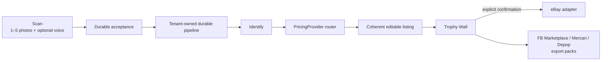

# SnapList

**Scan one item. Get an honest, editable listing. Send it where you sell.**

SnapList is a native Scan-to-Trophy-Wall product for average consumer resellers. It turns one to
five photos plus optional voice context into a priced listing with transparent evidence and seller
control. The first usable listing appears before signup or paywall.

`PRD.md` is the product source of truth. `AGENTS.md` is the repository workflow contract and
`CONTEXT.md` defines the domain language.

## Lean MVP

The native app has exactly two primary destinations:

- **Scan** accepts one to five ordered photos and an optional voice note capped at fifteen seconds.
  After durable server acceptance, the seller can immediately begin another item while processing
  continues asynchronously.
- **Trophy Wall** merges local pending intake with canonical server truth and shows compact,
  seller-facing states: accepted, analyzing, ready to review, needs retry, published to eBay, and
  export pack prepared/shared. Settings opens from the profile avatar.

One coherent result includes validated identity and condition, editable listing copy, a price
recommendation, composite confidence, and up to five trustworthy sold matches when available. When
evidence is unavailable, the listing still completes with an honestly labeled starting-price
estimate. Seller-facing copy never exposes queue, worker, lease, or provider terminology.

The first usable listing and first seller-confirmed eBay publish are free. App Attest-backed guest
authority, encrypted 24-hour recovery, RLS tenancy, durable AI-item credit settlement, and coherent
review correction protect the first-value path. SnapList Pro gates complete AI item run #2.

eBay is the only direct-publish destination, always through the transactional adapter and after
explicit seller confirmation. Facebook Marketplace, Mercari, and Depop receive prepared/shared
export packs through an honest share/deep-link handoff; SnapList never claims it filled or published
their forms.

Inbox/buyer messaging, generic analytics, post-sale operations, barcode-only capture, garment
measurements, bulk/haul launch posture, and autonomous marketplace actions are outside the lean MVP.
Historical code may remain while separately scoped retirement work proceeds; it is not current
product authority. See [ADR-0008](docs/adr/0008-native-launch-entitlement-credits-and-ebay-authority.md).

## Architecture



The seller-visible product is simple; the server keeps the difficult guarantees behind stable
interfaces:

- Clerk identity, text `user_id`, Postgres RLS, and private Supabase Storage isolate tenant data.
- App Attest guest capabilities preserve first value without turning the queue envelope into
  authorization.
- `pipeline_runs` owns durable execution/recovery truth. Supabase Queues carry identifiers only.
- The role-keyed Vercel AI SDK registry keeps model selection environment-controlled.
- `PricingProvider` routes structured ISBN lookup, eBay sold comps, cited web search, depreciation,
  and an honest terminal fallback.
- Caffein Apify is the intended primary automatic sold-comp adapter behind an operator-controlled
  activation gate. The public-page adapter is the fail-soft fallback; both use the same matcher.
- A valid seller price override is the effective price for eBay publish and every export pack.
- The eBay adapter is the only direct marketplace mutation seam and remains mockable offline.

One-to-five photo submission is implemented across the native client, verified upload, durable
acceptance, worker recovery, and review projection under
[#352](https://github.com/azizu06/snaplist/issues/352). Optional voice capture and upload follow the
contract from [#351](https://github.com/azizu06/snaplist/issues/351), and
[#774](https://github.com/azizu06/snaplist/issues/774) carries accepted voice context through the
durable listing pipeline. Hosted transcription remains explicitly environment-controlled, and every
terminal voice failure continues through the photos-only path.

## Stack

Next.js App Router + TypeScript · native SwiftUI · Vercel AI SDK · Zod · Clerk · Supabase Postgres,
RLS, Storage, Queues, and pgvector · Tailwind/shadcn for retained web surfaces · eBay Sell APIs behind
adapters · StoreKit/RevenueCat client lifecycle with server-authoritative AI-item credits.

## Getting started

```bash
pnpm install --frozen-lockfile
pnpm dev
```

Local Supabase is optional for unit-only work and required for RLS/integration suites. Never point
tests at shared or hosted data without the repository’s explicit coordination protocol.

## Verification

```bash
pnpm typecheck
pnpm test
pnpm eval
pnpm build
```

Useful focused commands:

```bash
pnpm test -- <path-to-test>
pnpm audit:migrations
pnpm unit-economics:check
pnpm eval:build-gold
```

CI runs typecheck, unit/contract tests, the offline eval, and a production build. Provider quality is
measured by the eval harness over a fixed gold set rather than brittle exact-match model tests.

## Evidence and accuracy boundaries

- Sold evidence is live-fetched, matched, freshness-aware, and persisted as one immutable snapshot.
- Asking prices never masquerade as accepted sale amounts.
- Evidence-backed tiers cite sources; only the clearly labeled terminal `llm-only` estimate may be
  uncited.
- Confidence is derived from tier trust, comp agreement, and identification completeness, never raw
  model self-report.
- Optional listing-example retrieval is default-off, evaluation-gated, and never factual, pricing,
  confidence, or seller-data authority.
- The eval fixture corpus and any synthetic/demo material are explicitly labeled and cannot become
  marketplace evidence.

## How we build

Work follows one issue → one branch → one isolated worktree → one PR. Each issue freezes a finite
observable outcome, owned surfaces, exclusions, blockers, and highest stable test seams before
implementation. Changed behavior uses public-seam TDD. Before merge, fresh read-only Standards and
Spec reviewers assess the exact head, followed by one applicable GitHub Codex review. See
[`AGENTS.md`](AGENTS.md) and [`docs/agents/`](docs/agents/).

## Documentation index

- [Product requirements](PRD.md)
- [Agent guide](AGENTS.md)
- [Domain glossary](CONTEXT.md)
- [Architecture decisions](docs/README.md)
- [Durable pipeline](docs/architecture/durable-pipeline.md)
- [Mobile API contract](docs/contracts/mobile-api-v1.openapi.json)
- [Sold-comps egress](docs/sold-comps-egress.md)

## License

SnapList is released under the [Apache License 2.0](LICENSE).
