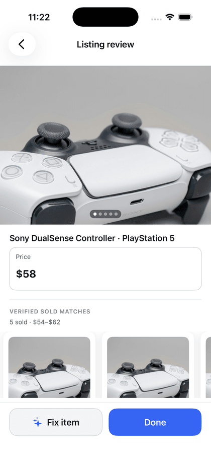
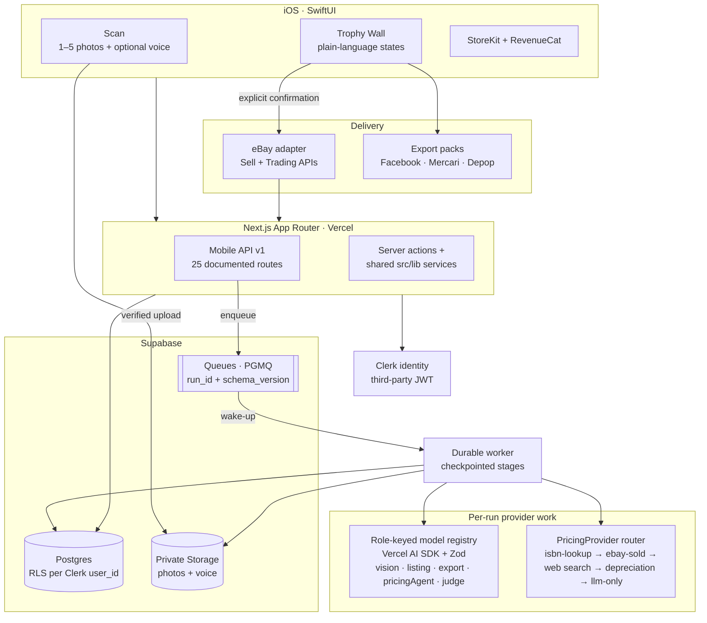
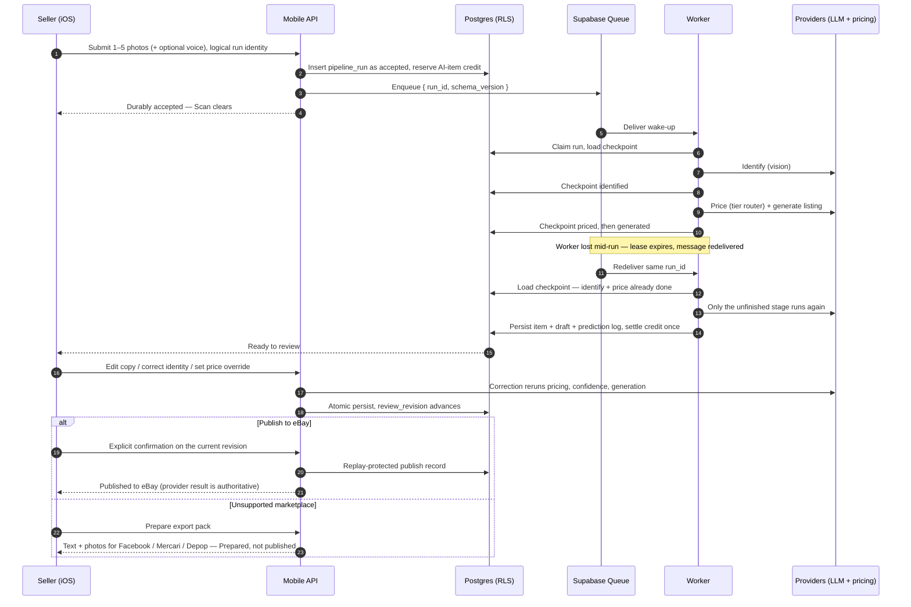

<h1 align="center">SnapList</h1>

<p align="center">
  <b>SnapList turns item photos into priced, editable resale listings that the seller reviews before publishing.</b>
</p>

<p align="center">
  <a href="https://github.com/azizu06/snaplist/actions/workflows/ci.yml"></a>
  <a href="https://github.com/azizu06/snaplist/actions/workflows/ios.yml"></a>
  <a href="LICENSE"></a>
  
  
  
</p>

<p align="center">
  
  &nbsp;&nbsp;
  
</p>

<p align="center">
  <sub>Listing review and Trophy Wall, captured unedited from the SwiftUI app in the iOS simulator on repository fixture data. See <a href="#screenshot-provenance">screenshot provenance</a>.</sub>
</p>

---

## The flow

| 1 · Scan | 2 · SnapList works | 3 · Review, then send |
| --- | --- | --- |
| One to five ordered photos, plus an optional voice note of at most fifteen seconds. Submit once; Scan clears after the server durably accepts, so the next item can start immediately. | Processing is asynchronous and recoverable. The app says *accepted*, *analyzing*, *ready to review*, or *needs retry* — never a queue, worker, or provider name. | One editable listing: identity, condition, title, description, item specifics, a price with its evidence, and a composite confidence. Publish to eBay on explicit confirmation, or take an export pack to Facebook Marketplace, Mercari, or Depop. |

The first usable listing arrives **before** signup or a paywall, on an App Attest-backed guest
allowance. Account creation is required only when the seller chooses to publish.

## What it does, and how it is built

| Seller-facing behavior | Engineering behind it | Code |
| --- | --- | --- |
| Submit once, keep going | Verified direct-to-Storage photo upload plus a tenant-owned logical run identity, so a retried submit resolves to the same run instead of a duplicate item | [`src/lib/mobile-item-submission`](src/lib/mobile-item-submission), [`src/lib/upload-staging`](src/lib/upload-staging) |
| "Analyzing" survives a crash, redeploy, or redelivery | Supabase Queues (PGMQ) carry only a `{ run_id, schema_version }` wake-up envelope; the tenant-owned `pipeline_runs` row owns status, stage, attempt, and a JSONB stage checkpoint. A resumed run skips the provider calls it already completed | [`src/lib/pipeline-queue/durable-processor.ts`](src/lib/pipeline-queue/durable-processor.ts) |
| A price with sources, not a guess | A `PricingProvider` routing pipeline: `isbn-lookup` → `ebay-sold` → `upc-aided-web` / `branded-web` → `depreciation` → a clearly labeled `llm-only` estimate. Every result is `{ suggested, range, confidence, sources[] }` and stays editable | [`src/lib/pricing/router.ts`](src/lib/pricing/router.ts), [`src/lib/pricing/providers`](src/lib/pricing/providers) |
| Up to five sold matches you can inspect | One provider-neutral matcher decides which retrieved rows become priced anchors; asking prices are never presented as accepted sale amounts | [`src/lib/pricing/sold-comp-matcher.ts`](src/lib/pricing/sold-comp-matcher.ts) |
| A confidence that means something | A pure composite of which tier fired, how well comps agree, and how complete the identification is — never the model's own self-report | [`src/lib/confidence/confidence.ts`](src/lib/confidence/confidence.ts) |
| Fix the identity, get a coherent re-price | A bounded pre-publish correction reruns the shared pricing router, confidence, and listing generation, then persists item, draft, and prediction log atomically under RLS — preserving a seller price override | [`src/lib/pipeline/review-regeneration.ts`](src/lib/pipeline/review-regeneration.ts) |
| The price you typed is the price that ships | A valid cent-normalized `items.price_override` beats recommendation history on every outbound path, and a price change advances `review_revision` so stale publishes and stale export packs fail closed | [`src/lib/listing-review`](src/lib/listing-review), [`src/lib/export/persist.ts`](src/lib/export/persist.ts) |
| Free first listing, then a subscription | An AI-item credit is reserved before provider work, settled exactly once when a usable draft is durable, and restored exactly once on earlier failure. Internal retries, recovery, and the included correction reuse the same credit | [`src/lib/billing/item-run-policy.ts`](src/lib/billing/item-run-policy.ts), [`src/lib/billing/revenuecat.ts`](src/lib/billing/revenuecat.ts) |
| Publish to eBay | The transactional eBay adapter is the only direct marketplace mutation seam: explicit seller confirmation, durable replay protection, and a mock adapter so the seam is testable offline | [`src/lib/marketplace/ebay`](src/lib/marketplace/ebay) |
| Honest handoff everywhere else | Facebook Marketplace, Mercari, and Depop get platform-shaped text and photos through the share sheet or a deep link plus a checklist. `Prepared` / `Shared` never means published | [`src/lib/export`](src/lib/export) |

## System architecture



The eBay **adapter** (transactional: publish) and the eBay **sold-comp** reader (read-only price
research) are deliberately separate seams. The sold-comp path can never post or message.

## One item, end to end



Stage checkpointing is not aspirational: `durable-processor.ts` guards each stage on the persisted
checkpoint, and
[`durable-processor.test.ts`](src/lib/pipeline-queue/durable-processor.test.ts) asserts that a
resumed run calls neither `identify` nor `price` again. The voice stage persists its attempt marker
*before* contacting a transcription provider, so an ambiguous response cannot bill twice.

## Evidence

Every number here comes from committed output in this repository, at the path shown. Nothing in this
section is estimated.

| Measure | Result | Source |
| --- | --- | --- |
| Offline test suite (`pnpm test`) | 2,938 passing, 243 skipped across 338 files. The skips are the database-backed suites, which need a running Supabase stack; CI's separate `database` job provisions one and fails rather than skips | [`.github/workflows/ci.yml`](.github/workflows/ci.yml) |
| Database contract suites | 35 pgTAP files covering RLS tenancy, lifecycle triggers, and queue authority | [`supabase/tests/`](supabase/tests) |
| Tenancy coverage in TypeScript | 36 `*.rls.test.ts` suites, 24 `*.migration.test.ts` suites | `src/lib/**` |
| Eval harness | 36-item gold set; the offline CI run scores checked-in sample predictions with a deterministic judge, and validates that judge against 8 human-labeled listings at **100% within ±1** on every axis | [`src/lib/eval`](src/lib/eval), `pnpm eval` |
| Sold-comp matcher replay (0 provider calls) | 914 labeled rows over 40 queries: **91.53%** anchor precision, 40.91% valid-comparable recall, at least two anchors on 16/40 queries | [`docs/benchmarks/sold-comps/ranking-replay/REPORT.md`](docs/benchmarks/sold-comps/ranking-replay/REPORT.md) |
| Sold-comp provider benchmark | Direct public-page retrieval was blocked on 92.5% of 40 fixed queries; the paid actor reached 95.0% coverage with 0% block, p50 19.7 s, for $3.66 total under a $5 ceiling | [`docs/benchmarks/sold-comps/latest/REPORT.md`](docs/benchmarks/sold-comps/latest/REPORT.md) |
| Retention and deletion matrix | 35 release data rows, each with a named owner, deletion trigger, maximum retention, executor, and completion proof | [`docs/contracts/lean-mvp-retention-v1.json`](docs/contracts/lean-mvp-retention-v1.json) |
| Security audit | OWASP pass across eight dimensions; one MEDIUM RLS-bypass and one verbose-error class found and fixed | [`docs/security/owasp-audit-2026-06.md`](docs/security/owasp-audit-2026-06.md) |

Two honest boundaries on the table above. The eval scores measure the harness against fixed
fixtures, not live model accuracy in the field — the `--real-judge` and live paths are local-only by
design. And the sold-comp benchmark is a *provider evaluation*: automatic paid sold-comp retrieval
ships **default-off** (`APIFY_SOLD_ENABLED=false`) behind an operator decision, with the public-page
adapter as the fail-soft fallback.

When no trustworthy sold evidence survives the matcher, the run still completes with a full editable
draft labeled `Starting price estimate` and `No verified sold matches found.` — a valid result, not a
stranded job.

## Technical decisions

Each one is an ADR with the context, the alternatives, and what it cost.

| Decision | Why it is interesting | ADR |
| --- | --- | --- |
| eBay sold listings as the primary used-price signal | True sold-price APIs are gated for solo developers; asking prices are weaker evidence and are down-weighted rather than laundered into a recommendation | [ADR-0001](docs/adr/0001-ebay-public-sold-comps-pricing.md) |
| A role-keyed LLM provider registry | Every model call site used to construct its provider inline, so "swappable" was a hope rather than a checked property. It is now one env flip — and a data boundary, not only a cost one | [ADR-0002](docs/adr/0002-llm-provider-registry-gemini-dev-openai-showcase.md) |
| Durable pipeline on Supabase Queues | Recoverability without adding a second broker, runtime, and deploy surface. Queue authority is deliberately *not* tenant authority | [ADR-0007](docs/adr/0007-durable-pipeline-supabase-queues.md) |
| Lean native launch, credits, and marketplace authority | Records what was cut, and why entitlement settles on durable value rather than on a provider response | [ADR-0008](docs/adr/0008-native-launch-entitlement-credits-and-ebay-authority.md) |
| Retrieval is evaluation-gated, default-off | A seeded vector corpus was expected to help listing generation. It never demonstrated a measurable reduction in seller work, so it cannot be a launch dependency or a pricing authority | [ADR-0010](docs/adr/0010-evaluation-gated-listing-example-retrieval.md) |
| A retention and deletion matrix, row by row | Account erasure cannot claim completion while any datum has an unresolved disposition or an executor without completion proof | [ADR-0012](docs/adr/0012-lean-mvp-retention-and-deletion-matrix.md) |

The full set, including provider-neutral hosting and voice context, is in
[`docs/README.md`](docs/README.md).

## Stack

| Layer | Choice |
| --- | --- |
| Native client | SwiftUI, iOS 17+, Observation, App Attest, StoreKit via RevenueCat |
| API and web | Next.js 16.2 App Router, TypeScript 5, React 19, Tailwind + shadcn/ui, deployed on Vercel |
| Identity | Clerk, issued into Supabase as third-party JWTs |
| Data | Supabase Postgres with RLS, private Storage, Queues (PGMQ), pgvector, cron |
| Models | Vercel AI SDK behind a role-keyed registry (OpenAI or Google per environment), structured output via `generateObject` + Zod |
| Pricing evidence | eBay sold-page research (cheerio), Tavily / Exa web search, ISBN catalog lookup |
| Marketplace | eBay Sell + Trading APIs behind adapters, sandbox → production by credential flip |
| Tooling | pnpm 10, Vitest, pgTAP, XCUITest, ESLint, GitHub Actions |

## Getting started

```bash
pnpm install --frozen-lockfile
cp .env.example .env.local     # fill in what you need; env validation is lazy
pnpm dev
```

A local Supabase stack is optional for unit-only work and required for the RLS, migration, and pgTAP
suites:

```bash
pnpm supabase start
```

The native client lives in [`ios/`](ios/README.md) — open `ios/SnapList.xcodeproj`, pick the shared
`SnapList` scheme and an iPhone simulator. Xcode 26.5, iOS 17.0 deployment target.

## Checks

Everything below was run against this commit.

```bash
pnpm typecheck            # tsc --noEmit
pnpm lint                 # eslint --max-warnings 0
pnpm audit:migrations     # 115 migration files, 115 unique versions
pnpm test                 # vitest; DB-backed suites skip unless a Supabase stack is up
pnpm eval                 # offline eval report over the gold set
pnpm unit-economics:check # regenerates and diffs the cost model
pnpm build                # must succeed with no secrets present
```

iOS tests run through the repository script, which owns the simulator lock and the shard budget:

```bash
DEVELOPER_DIR=/Applications/Xcode.app/Contents/Developer ios/Scripts/test.sh
```

CI runs typecheck → lint → migration audit → the offline Vitest suite → the offline eval → a
production build, in a job with **no secrets and no hosted database**, plus a separate job that
builds a throwaway Postgres from the branch's own migrations and runs the pgTAP contracts against it.

## Security and data boundaries

- **Tenant isolation.** Every domain row carries the Clerk `user_id`. Postgres RLS enforces isolation
  through `public.clerk_user_id()`; a foreign id is indistinguishable from a missing one. The worker
  derives ownership from the stored run through RLS or audited run-scoped RPCs — holding a queue
  message is not authorization.
- **Private Storage.** Seller photos and voice notes live in private buckets under Storage policies,
  never on a public URL.
- **Guest allowance without an open door.** The pre-signup allowance is bound to an Apple App Attest
  key, and the guest result is encrypted and recoverable for 24 hours before it is claimed or deleted.
- **Seller media never reaches an unpaid Gemini project.** Outside local development, the `vision`
  role refuses Google unless `GEMINI_BILLING_ENABLED=true` attests the project is billing-enabled —
  because the unpaid Gemini terms let Google use submitted content and let human reviewers read API
  input and output. The refusal is a hard config error, not a warning.
- **Encrypted marketplace tokens.** Per-user eBay OAuth grants are stored encrypted; the app-level
  sandbox fallback is restricted to one configured operator tenant.
- **Raw voice is temporary.** It is deleted after the first durable terminal transcription outcome
  and never later than 24 hours after acceptance; only a bounded transcript may persist, and it
  follows item and account deletion.
- **Deletion has completion proof.** [`docs/contracts/lean-mvp-retention-v1.json`](docs/contracts/lean-mvp-retention-v1.json)
  is the row-level authority; account erasure cannot report success while a disposition is
  unresolved. Provider-owned deletion is not counted as SnapList deletion.

## Screenshot provenance

Both images are unedited `xcrun simctl io screenshot` captures of a Debug build on a throwaway
iPhone 17 simulator (iOS 26.5), downscaled to 420 px wide and re-encoded. No compositing, retouching,
or mockup frames.

`docs/readme/trophy-wall.png` — launched directly with the flags
[`HomeVisualRegressionTests`](ios/SnapListUITests/HomeVisualRegressionTests.swift) uses for the
approved settled Trophy Wall state:

```
--visual-state=HOME-01 --zero-network-fixtures --reset-onboarding-progress --reduced-motion
```

`docs/readme/listing-review.png` — captured while
`SnapListUITests/ListingReviewUITests/testZeroAndFiveEvidenceStayTruthfulAndSoldDetailReturnsToInvoker`
drove the app, since listing review is reached by opening a Trophy Wall tile. Its launch flags:

```
--visual-state=HOME-01 --zero-network-fixtures --reset-onboarding-progress \
--run-detail-fixture=reviewable --listing-review-fixture=five-evidence \
--reset-listing-review-draft
```

The fixture item, price, and sold matches are the same values that test asserts on. The item photos
are the repository's locally hosted demo set, licensed and attributed in
[`docs/demo-asset-provenance.md`](docs/demo-asset-provenance.md).

## Documentation

| | |
| --- | --- |
| [`PRD.md`](PRD.md) | Product requirements — the source of truth for what is built and why |
| [`CONTEXT.md`](CONTEXT.md) | Domain glossary; the vocabulary the code and the UI both use |
| [`AGENTS.md`](AGENTS.md) | How work is done in this repository |
| [`docs/README.md`](docs/README.md) | Index of every ADR, architecture note, runbook, and contract |
| [`docs/architecture/durable-pipeline.md`](docs/architecture/durable-pipeline.md) | Run lifecycle, queue envelope, and the worker identity boundary |
| [`docs/contracts/mobile-api-v1.openapi.json`](docs/contracts/mobile-api-v1.openapi.json) | The provider-neutral transport the SwiftUI client speaks |
| [`docs/sold-comps-egress.md`](docs/sold-comps-egress.md) | Sold-comp egress, proxy template validation, and the operator smoke test |
| [`docs/unit-economics/OWNER-DECISION.md`](docs/unit-economics/OWNER-DECISION.md) | Provisional subscription pricing model and its assumption boundaries |

## License

[Apache License 2.0](LICENSE).
