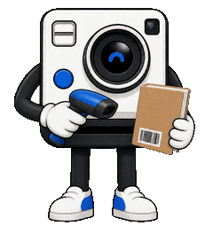
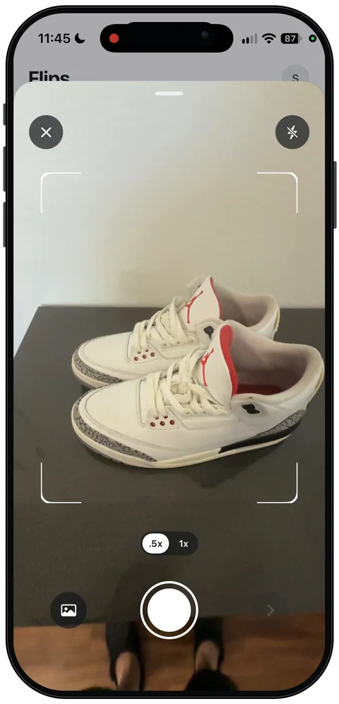
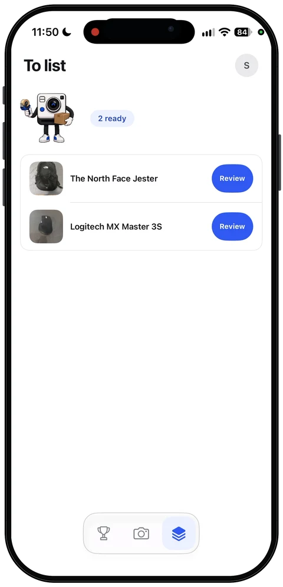
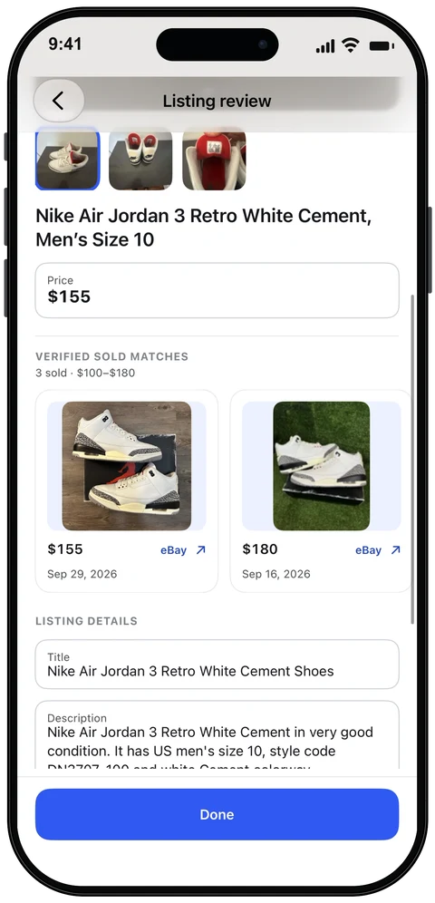
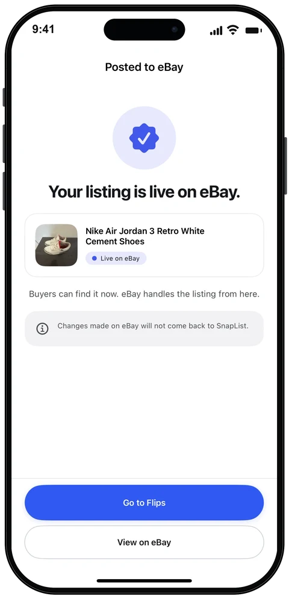
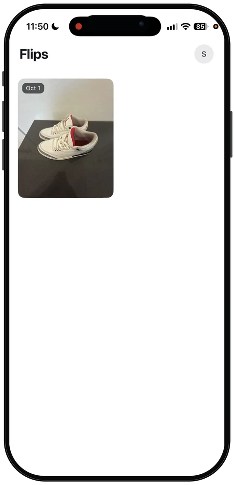
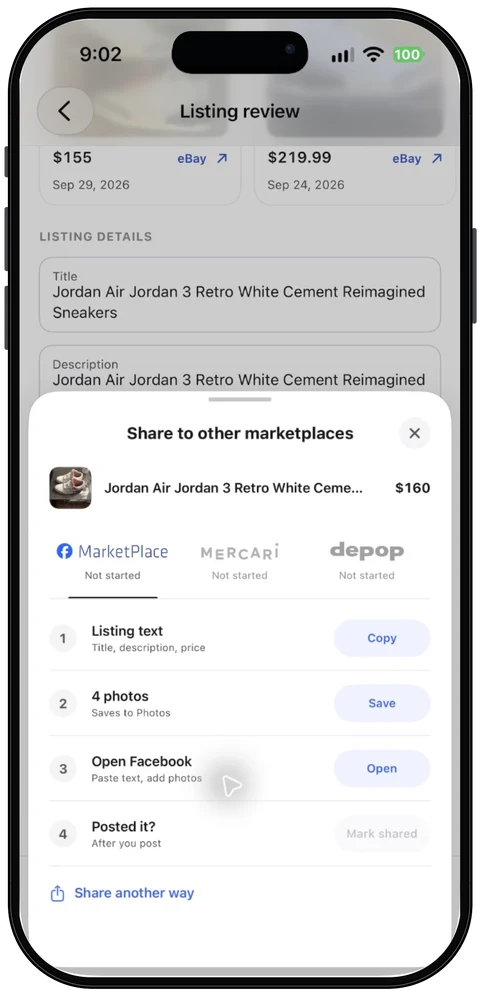
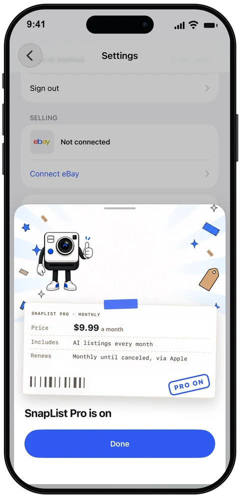

<h1 align="center">SnapList</h1>

<b>Turn the stuff you own into listings worth posting.</b>

  Snap a few photos, add a quick voice note, and get an editable resale listing with a starting price. 
  Spend less time researching and writing. Keep the final say on what goes out.

<b>Built for RevenueCat Shipaton 2026 · Next Gen track</b> Native iPhone app · Meet Scout, your listing companion

  
  &nbsp;
  
  &nbsp;
  

Capture → To list → review. Stills from the native iPhone demo recording in matching device frames. <a href="docs/readme/README.md">Screenshot notes and source timestamps</a>.

## From photo to flip

1. **Snap it.** Take one to five photos. Add an optional voice note of up to forty-five seconds for details the camera might miss.
2. **Get a draft.** AI identifies the item and writes a title, description, condition, and item details. Everything stays editable.
3. **Check the price.** SnapList researches comparable eBay sales and shows the matches it can verify. If reliable matches are unavailable, you still get a clearly labeled starting estimate. Set your own price at any time.
4. **Keep going.** Start the next item while earlier items process in parallel. **To list** keeps the ones waiting for review together, so you can work through several items without waiting between each one.
5. **Choose where it goes.** Review and confirm a direct eBay publish. For Facebook Marketplace, Mercari, or Depop, take the prepared text and photos into the marketplace and finish posting there yourself.
6. **See your Flips.** Finished items collect in a chronological view. An export marked prepared or shared stays distinct from an eBay publish; neither is a claim that the item sold.

  
  &nbsp;
  
  &nbsp;
  

Posted to eBay → Flips. Facebook Marketplace uses a guided handoff; this screen shows Not started.

The first usable listing comes **before signup or a paywall**. Try the result on your own item before deciding to keep listing.

## RevenueCat powers SnapList Pro

Scout meets you at a packing counter when you want more AI listings. The plan appears on a taped packing slip: price, renewal terms, Subscribe, and Restore, with Terms and Privacy close at hand.

 SnapList Pro is on — Apple sandbox demonstration. <a href="docs/readme/README.md">Screenshot notes</a>.

| Free first item | SnapList Pro |
| --- | --- |
| One complete AI listing, including one guided identity correction for the same photos. Review and edit the result before committing to a subscription. | Continue with new AI items through a monthly allowance. The second complete AI item run requires Pro. |

**RevenueCat handles the Apple subscription flow:** the iOS app loads the configured offering and localized product price, purchases through its SDK, and supports restoring purchases. The same integration connects the subscription to the signed-in SnapList account.

**The server confirms access.** RevenueCat subscription events update the verified Pro entitlement and billing period. A successful purchase screen alone cannot unlock AI credits. The app has confirming and pending states, and can resume the saved item once access is verified.

**Credits count useful results.** A credit settles when an editable, priced draft is saved. Technical retries and recovery reuse it; a failure before that point restores it. Pro’s monthly allowance is configurable while real usage costs are measured.

The integration is implemented and covered by purchase/restore fixtures and server contract tests.

## Built for the parts that matter

- **An iPhone experience, not a web form.** SwiftUI capture, optional voice context, compact editable fields, and Scout keep the work close to the item in your hand.
- **Work that survives interruption.** The TypeScript backend saves progress between identification, pricing, and writing. A recovered job continues from saved work instead of starting every AI call again.
- **Evidence you can question.** Sold results pass an item matcher before they support a price. Confidence comes from identification and pricing evidence. When research falls short, the app says so.
- **Your edits reach the marketplace.** One shared price rule carries your chosen price into eBay and export packs. Publish confirmation is protected against duplicate requests.
- **Private by design.** Supabase database policies isolate each seller's items; photos and voice notes use private storage. Guest access is tied to Apple's App Attest, with an encrypted result recoverable for 24 hours.

[Explore the implementation, tests, and measured benchmarks](docs/developer-guide.md).

## See it in action

**Demo video: coming soon.** This repository is the Shipaton showcase; an App Store release is not available yet.

To explore locally, open [`ios/SnapList.xcodeproj`](ios/SnapList.xcodeproj) in Xcode and follow the [iOS setup guide](ios/README.md). The [developer guide](docs/developer-guide.md#getting-started) covers the API, local Supabase, and verification commands.

## For builders

[Developer setup & architecture](docs/developer-guide.md) · [Product requirements](PRD.md) · [Documentation index](docs/README.md) · [Screenshot provenance](docs/readme/README.md)

[Apache License 2.0](LICENSE)
