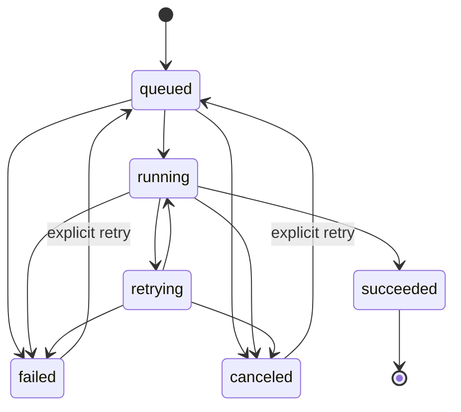

# Durable listing-pipeline architecture

> **Ratified target:** ADR-0007 and epic #157. Issues #158–#162 provide the queue foundation,
> durable producer/worker/recovery flow, and inactive-by-default operational contract.

## Responsibility split

`pipeline_runs`, not the PGMQ row, is the product-visible truth. PGMQ controls delivery and
redelivery; the run record controls lifecycle, ownership, idempotency, and safe recovery.

## Run contract

| Concern | Database contract |
| --- | --- |
| Tenant identity | `user_id` is the Clerk id and participates in every ownership relationship |
| Item relation | `(item_id, user_id)` references the same tenant's item |
| Listing relation | `(listing_id, item_id, user_id)` references the same tenant's listing for that item |
| Idempotency | unique `(user_id, idempotency_key)` |
| Queue pairing | one unique `queue_message_id`; repeat enqueue returns it |
| Attempts | `0 <= attempt_count <= max_attempts`; a claim increments by exactly one |
| Lease | one expiring fencing token; only its current holder may checkpoint, fail, or complete |
| Checkpoint | cumulative validated identify/price/generate output; maximum 256 KiB |
| Safe failure | bounded `failure_code` + `safe_failure_message`; no raw provider text or secrets |
| Time | created, updated, enqueued, started, last-attempted, and completed timestamps |
| Seller access | RLS read-own; insert is limited to identity/item/idempotency columns; no direct state update |
| Worker access | fixed service-role RPCs only; no direct table grant |

## Lifecycle

The processing stage moves forward through `queued → identifying → pricing → generating →
persisting → completed`. Retrying preserves the last durable stage/checkpoint; normal transitions
cannot move backward. `succeeded` is terminal and requires `completed`; failed/canceled states keep
the stage where work stopped.

## Queue contract and compatibility

- Queue name: `pipeline_jobs`.
- Type: Supabase Basic Queue created by `pgmq.create`; active and archive relations are logged.
- Payload: strict Zod schema `{ run_id: uuid, schema_version: 1 }`.
- Claim: `pgmq.read(queue, visibility_timeout_seconds, quantity)`.
- Retry/heartbeat: `pgmq.set_vt` extends invisibility for a bounded interval.
- Completion: explicit `pgmq.delete`; never `pgmq.pop`.
- Delay: omitted. The two-argument `send` is common to PGMQ 1.4.4 and 1.5+ and avoids the 1.5
  integer/timestamp overload ambiguity.
- Exposure: `pgmq` and `pgmq_public` are not Data API schemas. Raw queue grants are absent.

The in-memory adapter mirrors FIFO, visibility, redelivery, and explicit acknowledgement so unit and
CI tests do not depend on Docker or hosted Supabase. The real PGMQ contract is separately exercised
by fresh-reset pgTAP and two-tenant integration tests.

## Worker identity boundary

The queue envelope is not authorization. It contains no user id, photo path, signed URL, provider,
or authorization claim. A claim succeeds only when `(run_id, message_id)` matches the stored run.
The claim RPC joins the run to its item on both item id and owner, then returns only that derived
context. The superseded unfenced context, transition, and listing-link RPCs are no longer executable
by the worker identity.

The queue adapter and worker store accept capability-shaped RPC clients with fixed function names,
not a generic Supabase client. The runtime adapter encloses the service credential; the shared
provider-neutral composition root passes pipeline code only those capabilities plus private-photo
download. Durable completion derives
tenant/item identity from the leased run and atomically upserts one draft listing and one prediction
log. It has no publish, messaging, billing, or production-provider side-effect seam.

## Worker execution and resume

The protected internal consumer claims at most ten messages per invocation (five by default). Each
valid envelope acquires a message-paired run lease. Identification, pricing, and listing generation
reuse the existing TypeScript pipeline stages and persist cumulative checkpoints. Each checkpoint
renews both the database lease and queue visibility. A redelivery after expiry creates a new fencing
token and resumes from the last validated checkpoint; the stale worker can no longer write.

Transient failures persist safe text and exponential backoff before deferring the same PGMQ message.
Validation errors and exhausted attempts become terminal failures. The worker deletes a message only
after atomic draft completion or a durable terminal outcome. Successful completion retains exactly
one pre-staged item, one listing, and one prediction log per run.

## Scheduler, retention, and health

The application exposes scheduler-neutral, bearer-protected worker and maintenance routes. No
migration activates them. The owner-only template uses Supabase Cron + pg_net with an origin and
bearer secret read from Vault; the same HTTP contract can be invoked by another scheduler without
changing queue or worker behavior.

Each scheduled worker request claims one message with a 300-second visibility/lease window, retries at
30 seconds with bounded exponential backoff, and uses three attempts by default. A one-minute cadence
plus five-minute request ceiling bounds scheduled overlap at five independent requests; each claimed
run receives its full visibility window, while PGMQ visibility and per-run fencing remain the real
duplicate-delivery defense. The transport-neutral consumer still supports explicit bounded batches for
offline partial-completion acceptance.

Hourly maintenance performs a short, concurrency-fenced Postgres preparation followed by leased
Storage cleanup outside the transaction. Staging paths are deleted only when no item references them.
Abandoned failed/canceled captures are tombstoned only after every terminal attempt is 30 days old and
no listing or active/successful run protects the item. Retention locks and re-checks the item’s run rows,
then marks them non-retryable in the same transaction that queues photo cleanup, so a concurrent seller
retry either wins and protects the photos or waits and fails closed. Successful listing photos are never
cleanup candidates. Terminal run identities
remain for notifications and credit accounting while checkpoint/capture metadata is pruned. A
tombstoned failed/canceled run is explicitly non-retryable: the authenticated retry RPC fails closed,
and seller-facing progress directs the seller to start a new capture instead of enqueueing a run whose
photos no longer exist.

The maintenance response and structured log expose PGMQ depth/oldest age, retrying and terminal runs,
expired worker leases, cleanup backlog/dead letters, and the last cleanup outcome. See
`docs/runbooks/durable-pipeline-operations.md` for exact policy, local operation, Free-plan accounting,
queue drain, replay, rollback, and owner-only hosted activation.

## Issue #159 integration contract

Issue #159 remains the owner of single/batch upload UI, quota reservation, staging, and enqueue. Its
handoff to the worker is one tenant-owned pre-staged item with private `photos` paths and optional
`cost_basis`, plus one `pipeline_runs` row containing the capture-time
`capture_input.autopilot_enabled` snapshot; it then enqueues the identifiers-only version-1 envelope
once. Quota is reserved at that accepted-work boundary. The worker does not charge, reserve quota
again, read live seller settings, or accept those values from the queue message. On terminal failure,
it capability-detects and reuses #159's idempotent `release_pipeline_run_daily_reservation` seam;
transient retries and successful runs retain the reservation.

## Delivery ownership across epic #157

| Slice | Owns |
| --- | --- |
| #158 | ADR, run schema, queue, envelope, adapters, worker identity boundary |
| #160 | consumer, checkpoints, safe retries, durable pipeline execution |
| #159 | single/batch staging and enqueue, recoverable progress UX |
| #161 | completion/failure notifications, dashboard recovery, retry/cancel |
| #162 | Cron, retention, health, observability, crash/replay acceptance |
