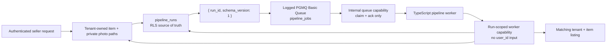
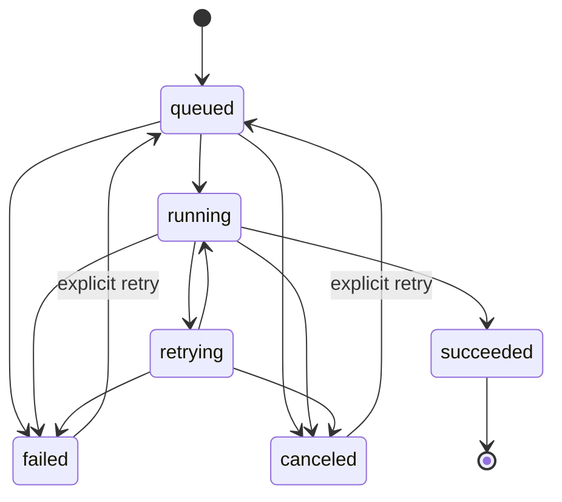

# Durable listing-pipeline architecture

> **Ratified target:** ADR-0007 and epic #157. Issue #158 provides the contract, queue, adapter, and
> identity boundary only; upload and batch still execute synchronously until their owning slices land.

## Responsibility split

`pipeline_runs`, not the PGMQ row, is the product-visible truth. PGMQ controls delivery and
redelivery; the run record controls lifecycle, ownership, idempotency, and safe recovery.

## Run contract

| Concern | Database contract |
| --- | --- |
| Tenant identity | `user_id` is the Clerk id and participates in every ownership relationship |
| Item relation | `(item_id, user_id)` references the same tenant's item |
| Listing relation | `(listing_id, item_id, user_id)` references the same tenant's listing for that item |
| Idempotency | unique `(user_id, idempotency_key)` |
| Queue pairing | one unique `queue_message_id`; repeat enqueue returns it |
| Attempts | `0 <= attempt_count <= max_attempts`; a claim increments by exactly one |
| Safe failure | bounded `failure_code` + `safe_failure_message`; no raw provider text or secrets |
| Time | created, updated, enqueued, started, last-attempted, and completed timestamps |
| Seller access | RLS read-own; insert is limited to identity/item/idempotency columns; no direct state update |
| Worker access | fixed service-role RPCs only; no direct table grant |

## Lifecycle

The processing stage moves forward through `queued → identifying → pricing → generating →
persisting → completed`. Retrying preserves the last durable stage/checkpoint; normal transitions
cannot move backward. `succeeded` is terminal and requires `completed`; failed/canceled states keep
the stage where work stopped.

## Queue contract and compatibility

- Queue name: `pipeline_jobs`.
- Type: Supabase Basic Queue created by `pgmq.create`; active and archive relations are logged.
- Payload: strict Zod schema `{ run_id: uuid, schema_version: 1 }`.
- Claim: `pgmq.read(queue, visibility_timeout_seconds, quantity)`.
- Completion: explicit `pgmq.delete`; never `pgmq.pop`.
- Delay: omitted. The two-argument `send` is common to PGMQ 1.4.4 and 1.5+ and avoids the 1.5
  integer/timestamp overload ambiguity.
- Exposure: `pgmq` and `pgmq_public` are not Data API schemas. Raw queue grants are absent.

The in-memory adapter mirrors FIFO, visibility, redelivery, and explicit acknowledgement so unit and
CI tests do not depend on Docker or hosted Supabase. The real PGMQ contract is separately exercised
by fresh-reset pgTAP and two-tenant integration tests.

## Worker identity boundary

The queue envelope is not authorization. It contains no user id. After claim, the worker calls
`load_pipeline_run_worker_context(run_id)`, whose SQL joins the stored run to the item on both item id
and owner. `link_pipeline_run_listing` applies the same run → item → listing ownership check.
`transition_pipeline_run` can mutate only lifecycle fields and is still constrained by the trigger.

The queue adapter and worker store accept capability-shaped RPC clients with fixed function names,
not a generic Supabase client. A later worker composition root may enclose the service credential to
construct those capabilities, but it must never pass the raw client into pipeline domain code.

## Delivery ownership across epic #157

| Slice | Owns |
| --- | --- |
| #158 | ADR, run schema, queue, envelope, adapters, worker identity boundary |
| #160 | consumer, checkpoints, safe retries, durable pipeline execution |
| #159 | single/batch staging and enqueue, recoverable progress UX |
| #161 | completion/failure notifications, dashboard recovery, retry/cancel |
| #162 | Cron, retention, health, observability, crash/replay acceptance |
