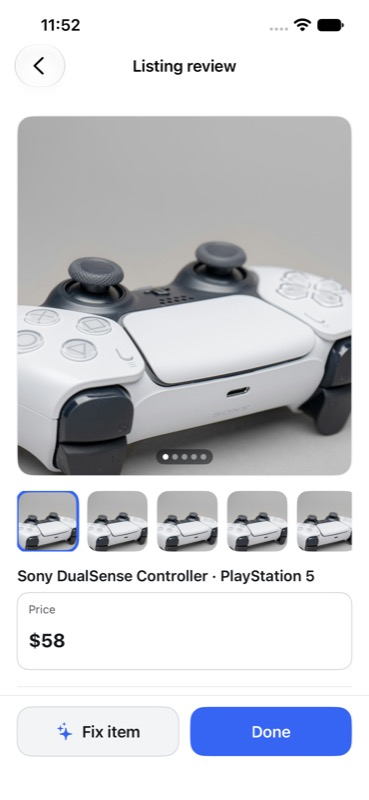
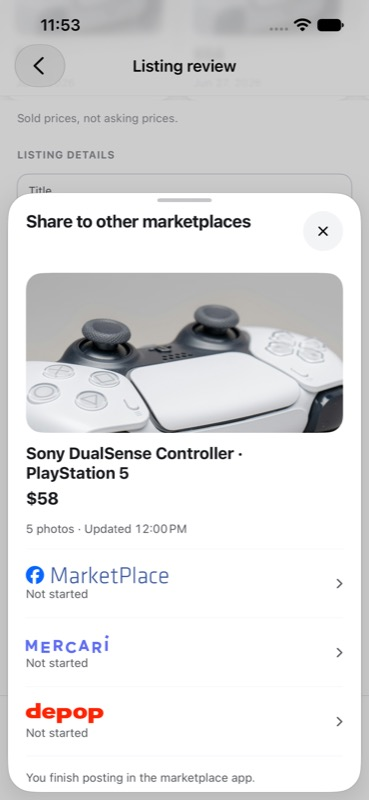
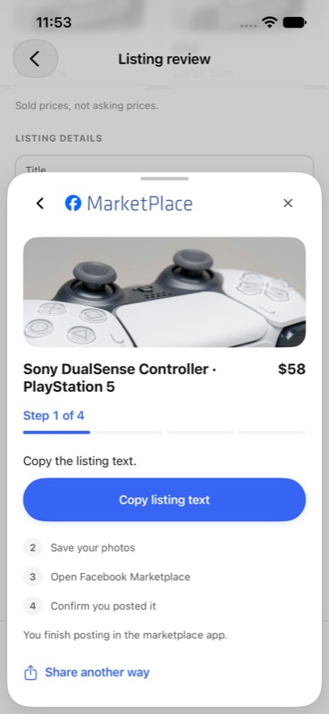
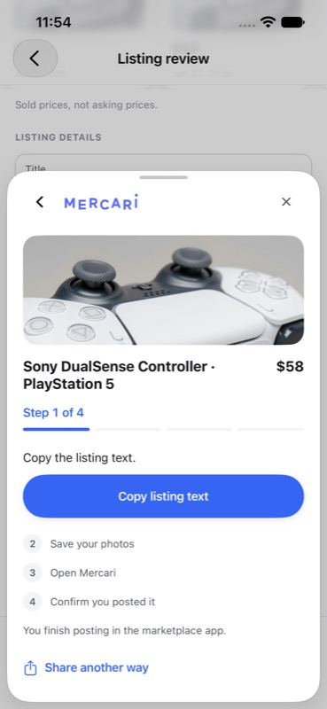
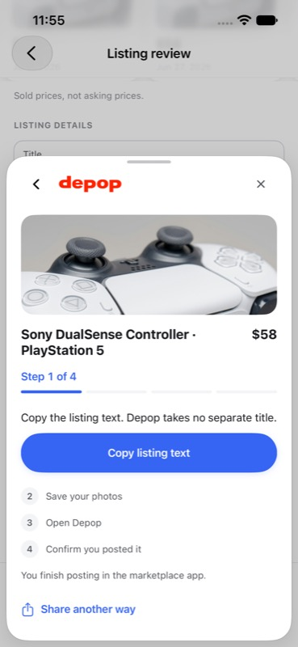
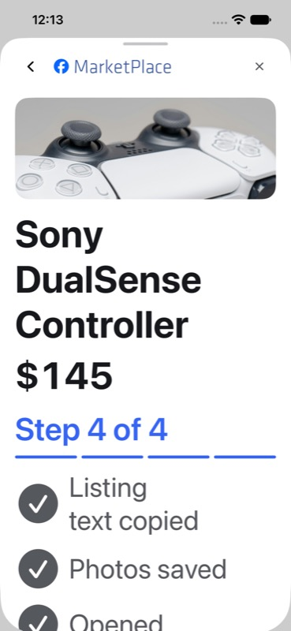

# Marketplace sharing revamp

The September 30 worker brief delegates a contextual sharing drawer in Listing Review, a prominent item hero, and readable per-platform instructions. The existing Assisted Export + Share Handoff v1 package remains the source for handoff truth. Its SHA-256 was checked before implementation and again before final visual acceptance: `bc01bccdee9a77f53e840e56a11bab12605be4c9c1b7454548d174e896f3aeb5`. This revamp changes presentation and navigation within the explicitly delegated scope; it adds no integrations.

Acceptance: Share opens over the current review; the drawer shows the item and effective price; Facebook Marketplace, Mercari, and Depop retain their wordmarks and existing four manual export steps; actions advance one step and resume after returning to selection; only seller confirmation records Shared; swipe dismissal, failed destination opening, stale-pack recovery, and accessibility controls remain usable.

## Rendered evidence

Captured from iPhone 17e on iOS 27, UDID `04D527BA-EDE2-4846-B36E-9213199386EB`, using isolated DerivedData. Screens 1 through 5 follow the genuine Trophy Wall -> Listing Review -> sharing route with deterministic zero-network fixtures. Screens 6 and 7 use the existing deterministic export fixture at Accessibility 5. Fixture device handoffs simulate photo-save and destination-open results; they are not evidence of a live marketplace accepting or posting a listing.

| Listing Review | Sharing drawer |
| --- | --- |
|  |  |

| Facebook Marketplace | Mercari | Depop |
| --- | --- | --- |
|  |  |  |

| Accessibility item identity | Accessibility confirmation |
| --- | --- |
|  |  |

## Verification

The existing `AssistedExportUITests` navigation test first failed against the pushed full-page route and then passed against the drawer. The focused export run passed 79 unit tests and 7 of 11 UI tests. Its four failures exposed two tests reading selector rows after the inline guide had replaced them, a swipe aimed at scroll content, and a fixture Dynamic Type override that did not reach the new sheet. The corrected six-test delta passed all six, including all four previous failures. A final Accessibility 5 confirmation test passed after stacking title and price to prevent broken-word wrapping.

Result bundles live under this worktree's `.artifacts/sharing/`: `navigation-red.xcresult`, `export-green.xcresult`, `export-delta-green.xcresult`, and `accessibility-final.xcresult`. No UI shard suite ran. No new test selectors were added; the existing selectors remain in their registered shards.

## Interactive fixture commands

Standalone Simulator.app can show the assigned device without opening Xcode's editor. The app must first be built and installed on this exact device.

```sh
xcrun simctl launch 04D527BA-EDE2-4846-B36E-9213199386EB dev.snaplist.ios --visual-state=HOME-01 --zero-network-fixtures --reset-onboarding-progress --run-detail-fixture=reviewable --listing-review-fixture=loaded --reset-listing-review-draft
```

Tap the first DualSense tile, scroll to Share to other marketplaces, and choose a platform. This fixture uses the live clipboard but placeholder remote photo URLs; photo delivery is simulated only in the next fixture.

```sh
xcrun simctl launch 04D527BA-EDE2-4846-B36E-9213199386EB dev.snaplist.ios --assisted-export-fixture=prepared --zero-network-fixtures --reset-onboarding-progress
```

For the simulated four-step walkthrough, copy text, save photos, open a destination, then confirm or cancel. Use `guide-step-4`, `destination-open-failure`, or `pack-out-of-date` instead of `prepared` for those states. Add `--dynamic-type=accessibility5` for the large-text matrix. Terminate the task-owned app before changing launch arguments.
